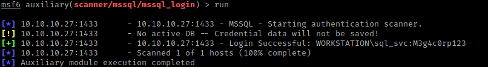
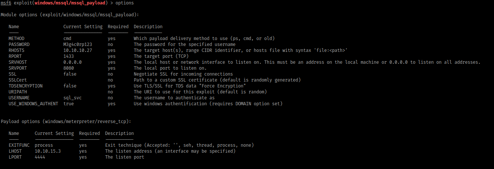

# Archetype

## Recon and Enum

### nmap
```
135/msrpc
139/SMB
445/SMB
1433/MS SQL

OS: Windows
```

### SMB
Found shares with smbclient
```
$ smbclient -L //10.10.10.27/    
Enter WORKGROUP\kali's password: 

        Sharename       Type      Comment
        ---------       ----      -------
        ADMIN$          Disk      Remote Admin
        backups         Disk      
        C$              Disk      Default share
        IPC$            IPC       Remote IPC
SMB1 disabled -- no workgroup available 
```

There is a file in the backups share that we have read access to:
```
<DTSConfiguration>
    <DTSConfigurationHeading>
        <DTSConfigurationFileInfo GeneratedBy="..." GeneratedFromPackageName="..."
GeneratedFromPackageID="..." GeneratedDate="20.1.2019 10:01:34"/>
    </DTSConfigurationHeading>
    <Configuration ConfiguredType="Property"
Path="\Package.Connections[Destination].Properties[ConnectionString]" ValueType="String">
        <ConfiguredValue>Data Source=.;Password=M3g4c0rp123;User
ID=ARCHETYPE\sql_svc;Initial Catalog=Catalog;Provider=SQLNCLI10.1;Persist Security
Info=True;Auto Translate=False;</ConfiguredValue>
    </Configuration>
</DTSConfiguration>
```

Possibly MS SQL login credentials?

## Verifying Credentials

I used a metasploit module to verify that the found username and password work for MS SQL.

```
> use auxiliary/scanner/mssql/mssql_login 
```

Set the options. Note: be sure to set USE_WINDOWS_AUTH to true or else it won't work!

Then run:




## Exploiting the SQL Server

Now that we know the credentials we can use the following metasploit exploit:



