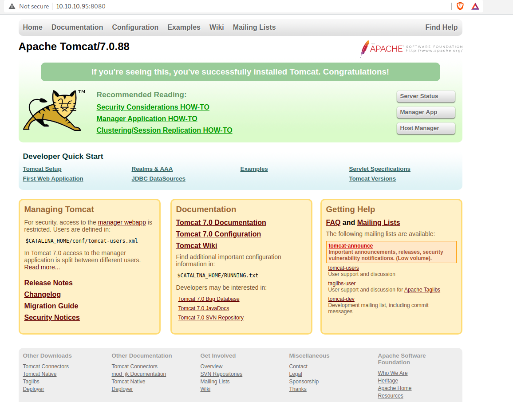
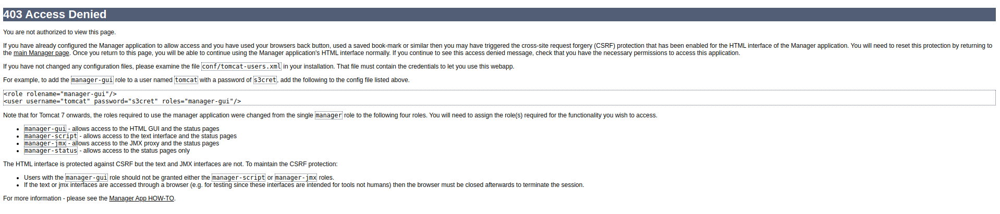
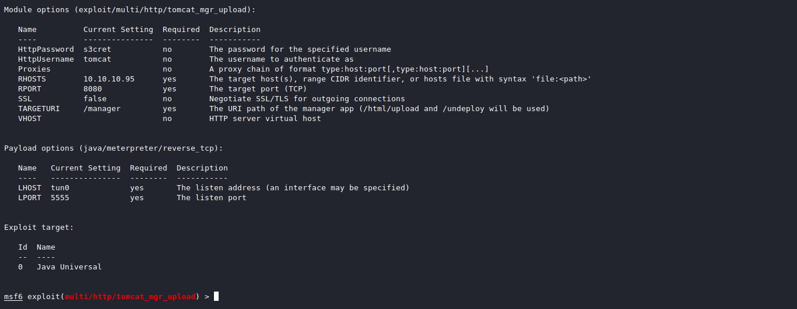

# Jerry

## Recon

As usual, being with an `nmap` scan of the target:

```
$ sudo nmap -A -T4 -p- 10.10.10.95 -oN nmap_scan.txt
Starting Nmap 7.91 ( https://nmap.org ) at 2021-03-27 12:38 EDT
Nmap scan report for 10.10.10.95
Host is up (0.13s latency).
Not shown: 65534 filtered ports
PORT     STATE SERVICE VERSION
8080/tcp open  http    Apache Tomcat/Coyote JSP engine 1.1
|_http-favicon: Apache Tomcat
|_http-server-header: Apache-Coyote/1.1
|_http-title: Apache Tomcat/7.0.88
Warning: OSScan results may be unreliable because we could not find at least 1
open and 1 closed port
Aggressive OS guesses: Microsoft Windows Server 2012 (91%), Microsoft Windows
Server 2012 or Windows Server 2012 R2 (91%), Microsoft Windows Server 2012 R2
(91%), Microsoft Windows 7 Professional (87%), Microsoft Windows 8.1 Update 1
(86%), Microsoft Windows Phone 7.5 or 8.0 (86%), Microsoft Windows 7 or Windows
Server 2008 R2 (85%), Microsoft Windows Server 2008 R2 (85%), Microsoft Windows
Server 2008 R2 or Windows 8.1 (85%), Microsoft Windows Server 2008 R2 SP1 or
Windows 8 (85%)
No exact OS matches for host (test conditions non-ideal).
Network Distance: 2 hops

TRACEROUTE (using port 8080/tcp)
HOP RTT       ADDRESS
1   133.70 ms 10.10.14.1
2   136.51 ms 10.10.10.95

OS and Service detection performed. Please report any incorrect results at
https://nmap.org/submit/ .
Nmap done: 1 IP address (1 host up) scanned in 185.21 seconds
```

The scan shows us that the target is running an Apache Tomcat webserver on port
8080. 

Let's check it out:



A default Apache Tomcat landing page. I viewed the source code with Ctrl+U, but
did not see anything interesting. 

When clicking on the "Manager App" button, you are prompted with a login panel.
I guessed admin for both the username and password, and was redirected to a 403
access denied page:




The error message gives an example username and password of `tomcat` and
`s3cret` respectively. Perhaps these are the correct credentials? I tried to log
back into the manager application, but the server automatically took me to the
403 page without a chance to login. 

I read the man page for `curl` and devised the following method to test login
credentials:

```
$ curl http://10.10.10.95:8080/manager/html -I                 
HTTP/1.1 401 Unauthorized
Server: Apache-Coyote/1.1
Cache-Control: private
Expires: Thu, 01 Jan 1970 02:00:00 EET
WWW-Authenticate: Basic realm="Tomcat Manager Application"
Content-Type: text/html;charset=ISO-8859-1
Transfer-Encoding: chunked 
Date: Sun, 28 Mar 2021 00:20:13 GMT
```

**^Note the "401 Unauthorized" response!**

```
$ curl http://10.10.10.95:8080/manager/html -u tomcat:s3cret -I
HTTP/1.1 403 Forbidden
Server: Apache-Coyote/1.1
Cache-Control: private
Expires: Thu, 01 Jan 1970 02:00:00 EET
Content-Type: text/html;charset=ISO-8859-1
Transfer-Encoding: chunked
Date: Sun, 28 Mar 2021 00:20:30 GMT
```

**^Note the "403 Forbidden" response!**

Now that we know the correct username and password, let's check metasploit for
an exploit module.
 
## Exploitation

I Google searched for "Apache Tomcat 7.0.88 vulnerabilities" and found a
[metasploit exploit module from
Rapid7](https://www.rapid7.com/db/modules/exploit/multi/http/tomcat_mgr_deploy/).

It uses a HTTP PUT request to upload a WAR reverse shell payload to the exposed
"manager" application on the web server.

I used to "tomcat_mgr_upload" module instead of the deploy one.

Below is a screenshot of my configured options:



With everything in place, time to exploit this machine! Enter `run` or `exploit`
to get a meterpreter prompt.

## Flag Finding

Both the user and root flags can be found by poking around the various
directories. No privilege escalation is needed here.

The flags are located in "Administrator/Desktop/flags/2 for the price of 1.txt"

```
meterpreter > cat Administrator/Desktop/flags/"2 for the price of 1.txt"
```


