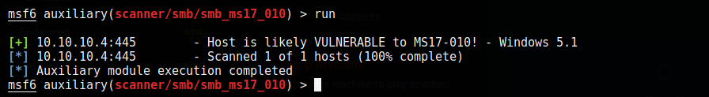
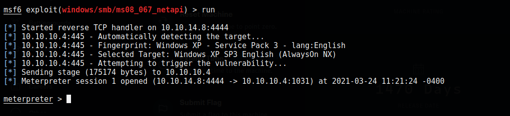

# Legacy

## Recon

Results of nmap scan

```
# Nmap 7.91 scan initiated Wed Mar 24 11:06:38 2021 as: nmap -sV -sC -T4 -Pn
-oN nmap_scan.txt 10.10.10.4
Nmap scan report for 10.10.10.4
Host is up (0.14s latency).
Not shown: 997 filtered ports
PORT     STATE  SERVICE       VERSION
139/tcp  open   netbios-ssn   Microsoft Windows netbios-ssn
445/tcp  open   microsoft-ds  Windows XP microsoft-ds
3389/tcp closed ms-wbt-server
Service Info: OSs: Windows, Windows XP; CPE: cpe:/o:microsoft:windows,
cpe:/o:microsoft:windows_xp

Host script results:
|_clock-skew: mean: 5d00h31m18s, deviation: 2h07m16s, median: 4d23h01m18s
| nbstat: NetBIOS name: LEGACY, NetBIOS user: <unknown>, NetBIOS MAC:
00:50:56:b9:1f:44 (VMware)
| Names:
|   LEGACY<00>           Flags: <unique><active>
|   HTB<00>              Flags: <group><active>
|   LEGACY<20>           Flags: <unique><active>
|   HTB<1e>              Flags: <group><active>
|   HTB<1d>              Flags: <unique><active>
|_  \x01\x02__MSBROWSE__\x02<01>  Flags: <group><active>
| smb-os-discovery: 
|   OS: Windows XP (Windows 2000 LAN Manager)
|   OS CPE: cpe:/o:microsoft:windows_xp::-
|   Computer name: legacy
|   NetBIOS computer name: LEGACY\x00
|   Workgroup: HTB\x00
|_  System time: 2021-03-29T20:08:14+03:00
| smb-security-mode: 
|   account_used: <blank>
|   authentication_level: user
|   challenge_response: supported
|_  message_signing: disabled (dangerous, but default)
|_smb2-time: Protocol negotiation failed (SMB2)

Read data files from: /usr/bin/../share/nmap
```

We see that ports 139 and 445 are open. These are typically used for SMB/Samba.
The scripts ran also tell us that it is running SMB2 (service pack version 2).

Let's fire up metasploit to search for an exploit.

## Initial Foothold

We know the target is a Windows box running SMB. I wanted to check if the target
was vulnerable to eternalblue, since that is a well-known Windows exploit.

So I ran an auxiliary scanner to test:




Despite the scanner saying that this target is vulnerable, the actual exploit
failed. This is because eternalblue only works on 64-bit operating systems and
our target is a 32-bit operating system.

Moving on, I tried the ms08_067_netapi exploit and was able to get a meterpreter
shell.



## Finding user.txt

From here, finding the user.txt flag is as simple as searching around the
filesystem for the user's home folder.

```
C:\Documents and Settings\john\Desktop>dir
dir
 Volume in drive C has no label.
 Volume Serial Number is 54BF-723B

 Directory of C:\Documents and Settings\john\Desktop

16/03/2017  09:19     <DIR>          .
16/03/2017  09:19     <DIR>          ..
16/03/2017  09:19                 32 user.txt
               1 File(s)             32 bytes
               2 Dir(s)   6.297.669.632 bytes free
```

## Privilege Escalation

No need! We are already the NT AUTHORITY\SYSTEM. This user already has full
access to everything on the system.

Check this with the getuid command in meterpreter.

```
meterpreter > getuid
Server username: NT AUTHORITY\SYSTEM
```

The root.txt flag is in the Administrator's Desktop:

```
meterpreter > ls Administrator/Desktop
Listing: Administrator/Desktop
==============================

Mode              Size  Type  Last modified              Name
----              ----  ----  -------------              ----
100444/r--r--r--  32    fil   2017-03-16 02:18:19 -0400  root.txt
```
