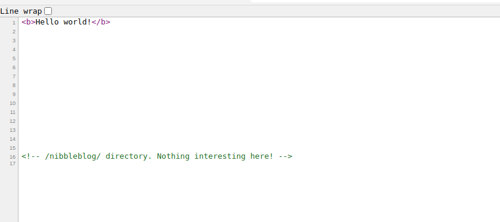
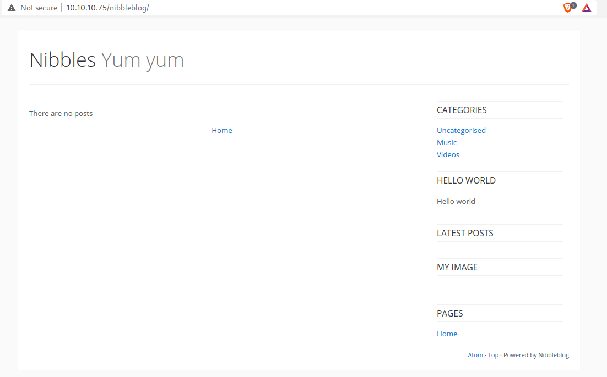
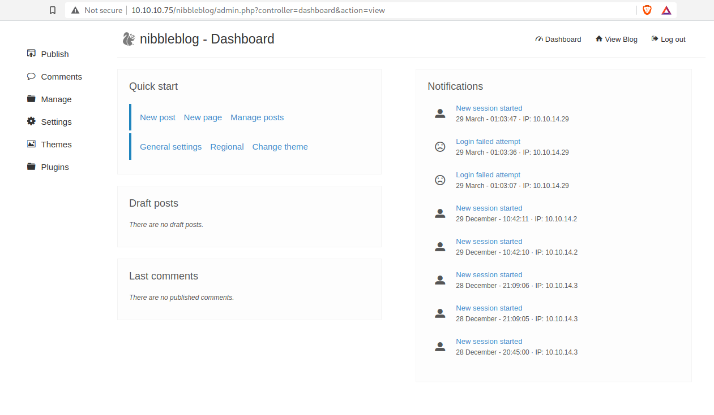
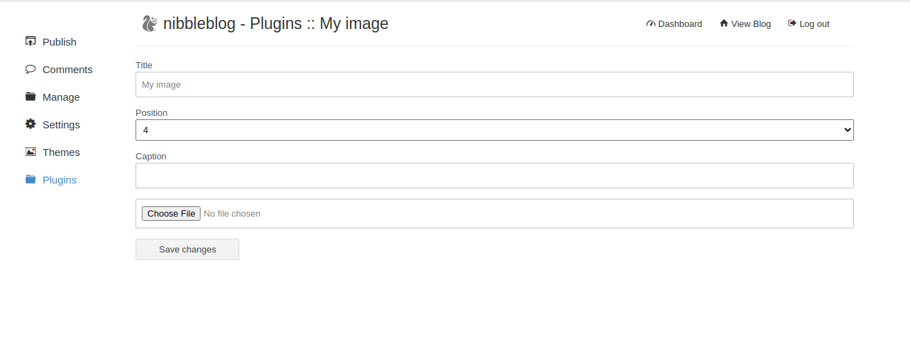
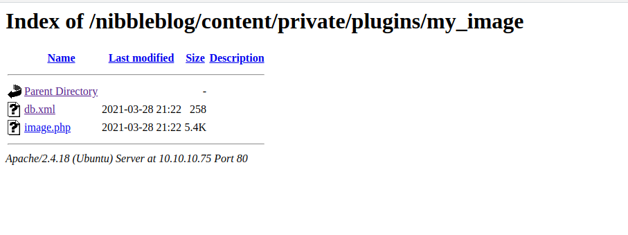
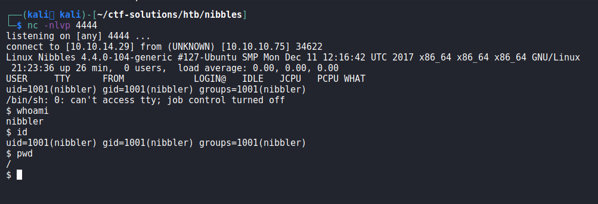

# Nibbles

Nibbles is a HackTheBox machine focused on exploit misconfigured files on web
servers.

## Recon

Let's checkout what services are running on the target with `nmap`:

```
$ sudo nmap -A -T4 -p- 10.10.10.75 -oN nmap_scan.txt
Nmap scan report for 10.10.10.75
Host is up (0.13s latency).
Not shown: 65533 closed ports
PORT   STATE SERVICE VERSION
22/tcp open  ssh     OpenSSH 7.2p2 Ubuntu 4ubuntu2.2 (Ubuntu Linux; protocol 2.0)
| ssh-hostkey: 
|   2048 c4:f8:ad:e8:f8:04:77:de:cf:15:0d:63:0a:18:7e:49 (RSA)
|   256 22:8f:b1:97:bf:0f:17:08:fc:7e:2c:8f:e9:77:3a:48 (ECDSA)
|_  256 e6:ac:27:a3:b5:a9:f1:12:3c:34:a5:5d:5b:eb:3d:e9 (ED25519)
80/tcp open  http    Apache httpd 2.4.18 ((Ubuntu))
|_http-server-header: Apache/2.4.18 (Ubuntu)
|_http-title: Site doesn't have a title (text/html).
No exact OS matches for host (If you know what OS is running on it, see
https://nmap.org/submit/ ).
TCP/IP fingerprint:
OS:SCAN(V=7.91%E=4%D=3/27%OT=22%CT=1%CU=36141%PV=Y%DS=2%DC=T%G=Y%TM=605F6F3
OS:E%P=x86_64-pc-linux-gnu)SEQ(SP=107%GCD=1%ISR=108%TI=Z%CI=I%II=I%TS=8)OPS
OS:(O1=M54DST11NW7%O2=M54DST11NW7%O3=M54DNNT11NW7%O4=M54DST11NW7%O5=M54DST1
OS:1NW7%O6=M54DST11)WIN(W1=7120%W2=7120%W3=7120%W4=7120%W5=7120%W6=7120)ECN
OS:(R=Y%DF=Y%T=40%W=7210%O=M54DNNSNW7%CC=Y%Q=)T1(R=Y%DF=Y%T=40%S=O%A=S+%F=A
OS:S%RD=0%Q=)T2(R=N)T3(R=N)T4(R=Y%DF=Y%T=40%W=0%S=A%A=Z%F=R%O=%RD=0%Q=)T5(R
OS:=Y%DF=Y%T=40%W=0%S=Z%A=S+%F=AR%O=%RD=0%Q=)T6(R=Y%DF=Y%T=40%W=0%S=A%A=Z%F
OS:=R%O=%RD=0%Q=)T7(R=Y%DF=Y%T=40%W=0%S=Z%A=S+%F=AR%O=%RD=0%Q=)U1(R=Y%DF=N%
OS:T=40%IPL=164%UN=0%RIPL=G%RID=G%RIPCK=G%RUCK=G%RUD=G)IE(R=Y%DFI=N%T=40%CD
OS:=S)

Network Distance: 2 hops
Service Info: OS: Linux; CPE: cpe:/o:linux:linux_kernel

TRACEROUTE (using port 80/tcp)
HOP RTT       ADDRESS
1   132.54 ms 10.10.14.1
2   132.29 ms 10.10.10.75

OS and Service detection performed. Please report any incorrect results at
https://nmap.org/submit/ .
Nmap done: 1 IP address (1 host up) scanned in 418.01 seconds
```

We see that the target is running Linux, and has ssh and http enabled. Let's
open a web browser and check out the website. 

At first sight, there isn't much there besides a "Hello, world" message.
However, examining the source code with Ctrl+U shows that there is a hidden
directory commented out:

 

Navigate to that hidden directory:



I started poking around the website to find any vulnerabilities or injection
points. The
"http://10.10.10.75/nibbleblog/index.php?controller=blog&action=view&category=uncategorised"
URL caught my eye. Perhaps these HTTP GET parameters are vulnerable to SQL injection?

I tested this out with `sqlmap`, but none of the parameters were vulnerable to
SQLi.

### Webserver Enumeration

At this point I wanted to enumerate the website further, so I ran `gobuster` and
found the following hidden files and directories.

```
$ gobuster dir -u http://10.10.10.75/nibbleblog -w /usr/share/wordlists/dirbuster/directory-list-2.3-small.txt -x php,txt | tee gobuster_ex.txt

/index.php            (Status: 200) [Size: 2987]
/sitemap.php          (Status: 200) [Size: 402] 
/content              (Status: 301) [Size: 323] [--> http://10.10.10.75/nibbleblog/content/]
/feed.php             (Status: 200) [Size: 302]                                             
/themes               (Status: 301) [Size: 322] [--> http://10.10.10.75/nibbleblog/themes/] 
/admin                (Status: 301) [Size: 321] [--> http://10.10.10.75/nibbleblog/admin/]  
/admin.php            (Status: 200) [Size: 1401]                                            
/plugins              (Status: 301) [Size: 323] [--> http://10.10.10.75/nibbleblog/plugins/
...
```

I will only be discussing `admin.php` in the writeup, but I encourage you to
poke around and explore the other files as well.

## Initial Foothold

The `admin.php` page contains a login panel for managing the blog. Since we
already know there is an admin user, all we need is the password. I tried
`hydra` with rockyou.txt as the wordlist, but grew impatient as it was taking so long. 
Instead, I was able to guess that `nibbles` is the password. lol~

Now we have full access to the blog!



## Vulnerability Discover

I searched online for "nibbleblog vulnerabilities" and found a 
[shell upload exploit technique from packetstorm](https://packetstormsecurity.com/files/133425/NibbleBlog-4.0.3-Shell-Upload.html).

Here's the snippet that describes the vulnerability:
> When uploading image files via the "My image" plugin - which is delivered with NibbleBlog by default - , NibbleBlog 4.0.3 keeps the
> original extension of uploaded files. This extension or the actual file type are not checked, 
> thus it is possible to upload PHP files and gain code execution.

> Please note that admin credentials are required.

## Exploitation

I continued to follow the steps in the above link and uploaded a PHP reverse
shell.



After setting up a `netcat` listener, time to execute the payload:






The user flag is in `/home/nibbler/user.txt`.

## Privilege Escalation

Performing a `sudo -l` reveals our current user can execute the script
`monitor.sh` as root. But where is this file located?

Within nibbler's home directory there is a folder named `personal.zip`. 
We need to `unzip` it a move into the extracted directories to find the `monitor.sh` shell script.

Since we have full permissions for this script, I did the following to print out
the root flag:

```
$ echo "cat /root/root.txt" >> monitor.sh
$ sudo ./monitor.sh
```

## Conclusion

I had a lot of fun with this box. Guessing the admin credentials and figuring
out the privilege escalation vector was very satisfying.
