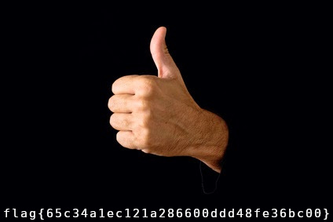

# Pollex

"Pollex" is a warmup challenge worth 50 points.

> 👍
>Download the file below.
> Some people seem to have trouble reading this, understandably so. Sorry. The
> flag ends in these characters: 8fe36bc00} 

I downloaded and opened the challenge file:


I then ran ```strings``` to check for any low-hanging fruit, but didn't find any.

The next step was running ```file```:

```
$ file pollex.jpg
pollex.jpg: JPEG image data, JFIF standard 1.01, aspect ratio, density 1x1,
segment length 16, Exif Standard: [TIFF image data, little-endian, direntries=5,
description=Man giving thumb up on dark black background., software=Google],
baseline, precision 8, 424x283, components 3
```

Interesting. This is a lot more info than I was expecting for a simple jpg. 

Use ```binwalk``` to see what else is hidden within the image:

```
$ binwalk pollex.jpg

DECIMAL       HEXADECIMAL     DESCRIPTION
--------------------------------------------------------------------------------
0             0x0             JPEG image data, JFIF standard 1.01
30            0x1E            TIFF image data, little-endian offset of first
image directory: 8
334           0x14E           JPEG image data, JFIF standard 1.01
364           0x16C           TIFF image data, little-endian offset of first
image directory: 8
848           0x350           JPEG image data, JFIF standard 1.01
6731          0x1A4B          Copyright string: "CopyrightOwner> <rdf:Seq/>
</plus:CopyrightOwner> <plus:Licensor> <rdf:Seq/> </plus:Licensor> <dc:creator>
<rdf:Seq> <rdf:li>Ste"
6765          0x1A6D          Copyright string: "CopyrightOwner> <plus:Licensor>
<rdf:Seq/> </plus:Licensor> <dc:creator> <rdf:Seq> <rdf:li>Stevanovic
Igor</rdf:li> </rdf:Seq> <"""""
```

There is another JPEG image embedded at offset 334. Since forensics is not my
strong suit, I turned to Google for help. This [great CTF write from
z0rex](https://github.com/VulnHub/ctf-writeups/blob/master/2016/sctf/banana-boy.md)
showed me that the data can be extracted with ```dd```.

```
$ dd if=pollex.jpg of=pollex-2.jpg skip=334 bs=1
37584+0 records in
37584+0 records out
37584 bytes (38 kB, 37 KiB) copied, 0.601104 s, 62.5 kB/s
```

**Note:** Since the default block size (bs) of ```dd``` is 512, it will skip
over the 334 offset. To correct this, we set the block size equal to 1 (bs=1).

The flag is in the new image!



**Note 2**: for those curious, the second JPEG at offset 848 is the same image, with smaller text


