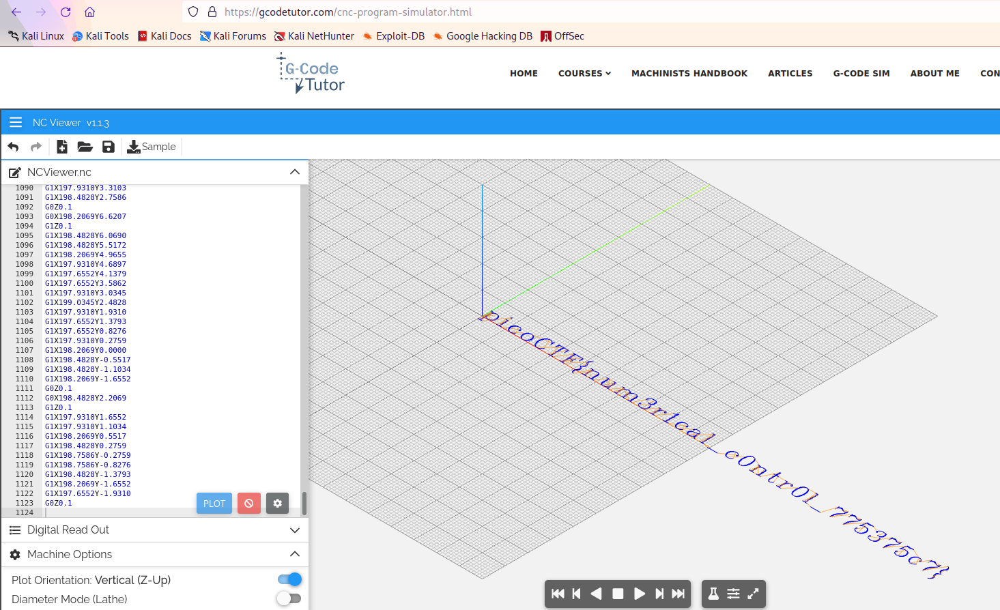

# speeds and feeds

## Details

Category: Reverse Engineering

Points: 50

## Writeup

Challenge description

> There is something on my shop network running at nc mercury.picoctf.net 53740, but I can't tell what it is. Can you?

When we connect to the host and port we are flooded with info. 

```gcode
G17 G21 G40 G90 G64 P0.003 F50
G0Z0.1
G0Z0.1
G0X0.8276Y3.8621
G1Z0.1
G1X0.8276Y-1.9310
G0Z0.1
G0X1.1034Y3.8621
G1Z0.1
G1X1.1034Y-1.9310
... <redacted for brevity>
```

I suggest running the following to redirect output to a file:

```
nc mercury.picoctf.net 53740 > out
```

This data means nothing to me, so I checked out the challenge hint.

> What language does a CNC machine use?

After some searching, I found that [CNC machines](https://www.fastradius.com/resources/intro-to-cnc-machine-programming/) use G-Code to
move mechanical parts like drills.

The [G-Code Tutor](https://gcodetutor.com/cnc-program-simulator.html) website allows us to visualize G-Code. Plop in our code from the
`out` file and we get the flag!


