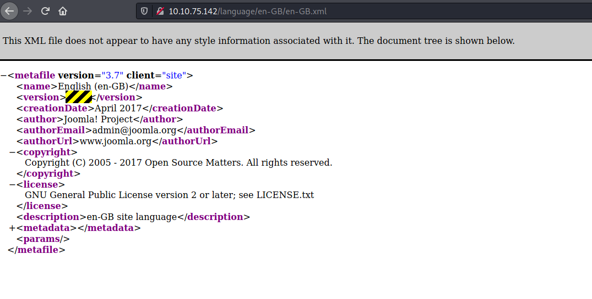

# Daily Bugle

## Initial Recon 

Scan the IP with nmap to see which ports are open:

```
$ nmap -sV -sC -T4 -oN nmap_initial.txt 10.10.75.142

PORT     STATE SERVICE VERSION
22/tcp   open  ssh     OpenSSH 7.4 (protocol 2.0)
| ssh-hostkey: 
|   2048 68:ed:7b:19:7f:ed:14:e6:18:98:6d:c5:88:30:aa:e9 (RSA)
|   256 5c:d6:82:da:b2:19:e3:37:99:fb:96:82:08:70:ee:9d (ECDSA)
|_  256 d2:a9:75:cf:2f:1e:f5:44:4f:0b:13:c2:0f:d7:37:cc (ED25519)
80/tcp   open  http    Apache httpd 2.4.6 ((CentOS) PHP/5.6.40)
| http-robots.txt: 15 disallowed entries 
| /joomla/administrator/ /administrator/ /bin/ /cache/ 
| /cli/ /components/ /includes/ /installation/ /language/ 
|_/layouts/ /libraries/ /logs/ /modules/ /plugins/ /tmp/
3306/tcp open  mysql   MariaDB (unauthorized)
```

This scan searches for version information (-sV), runs default scripts (-sC),
goes faster than normal (-T4), and saves results (-oN) to nmap_initial.txt.

We see that SSH, HTTP, and MySQL are all running on the remote host.

Let's first go to the web server:


From the nmap scan we know there is a robots.txt file that tells web crawlers
which pages to avoid.

Our task is to find out which version of Joomla is running. I Googled and found
this [page from
docs.joomla.org](https://docs.joomla.org/How_to_check_the_Joomla_version).

After some digging I found the following webpage that reveals the version
number:



## Vulnerability Discovery

Now that we know the Joomla version, see if there is an entry in searchsploit:

```
$ searchsploit joomla 3.7.0
```


