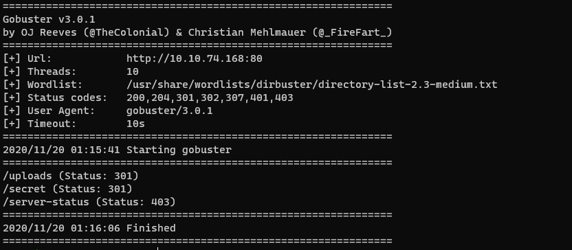

# GamingServer
> An Easy Boot2Root box for beginners.

## Enumeration

### nmap
I ran nmap to scan the network for open ports and services:

```
nmap -sV -sC -Pn $IP
```


The target has ssh and http open. I headed to the web server and found the
following comment in the source code:

> john, please add some actual content to the site! lorem ipsum is horrible to
> look at.

Maybe this is a username we can use to login to ssh later? The next step is to
scan the web server for any hidden web pages. My tool of choice is gobuster.

### gobuster

```
gobuster dir -w /usr/share/wordlists/dirbuster/directory-list-2.3-medium.txt -u http://$IP:80
```


Looks like gobuster found two hidden directories: /uploads and /secret.

Inside /uploads is "dict.lst", a list of passwords. Inside of /secret is a
private RSA key named "secretKey".

### Gaining Access

The secretKey can be used to ssh into the target as john, but it is passphrase
protected. In order to crack it we can use John The Ripper (JTR).

First, we need to convert the RSA key into a format that JTR will like. This can
be done with
[ssh2john.py](https://raw.githubusercontent.com/magnumripper/JohnTheRipper/bleeding-jumbo/run/ssh2john.py).

```
/opt/john/ssh2john.py secretKey > for_john.txt
```
Now run JTR:


**Note:** If you get the error that secretKey permissions are too open, run
this: ``` chmod 0600 secretKey```

Once the passphrase is know, ssh into the target device as john.

### User flag
Inside of john's home directory is the user flag.

### Privilege Escalation

#### Failed Attempts
I think it is important to highlight ideas I tried that did not work on this
device. They are valid techniques that may come in handy in other CTF
challenges. If you are just looking for the answer, skip to the Solution
section.

---

### Failed Attempt #1: sudo -l
In order to get the root user's flag, we need to escalate our priviliges. I
always begin by running ```sudo -l``` but this requires us to know john's
password, which we don't.

### Failed Attempt #2: searching for setuid binaries
My next approach was to find any setuid binaries that may give us a shell with
help from [GTFOBins](https://gtfobins.github.io/).

```
find / -perm -u=s -type f 2>/dev/null
...
/usr/bin/pkexec
...
```

This is a command that can easily get a privileged shell with ```sudo
/usr/bin/pkexec /bin/sh```.
However, we cannot use it without knowing john's password :(

### Solution: linpeas and lxd
After my first two ideas did not go anywhere, I decided to upload and run
linpeas on the target to look for further privilege escalation options.


The script showed that john is in the lxd group. lxc is a Linux container and
lxd is a daemon that runs lxc. After some googling, I found this great article
on [lxd privilege escalation](https://www.hackingarticles.in/lxd-privilege-escalation/).

## Root flag
Following the steps in the article, I was able to spawn a shell as the root
user and print our the flag.
