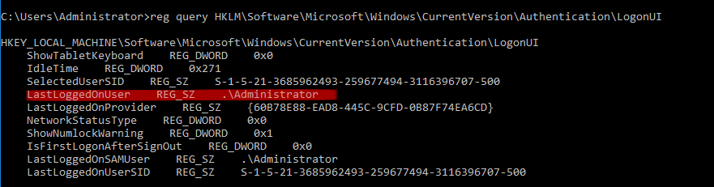
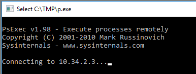
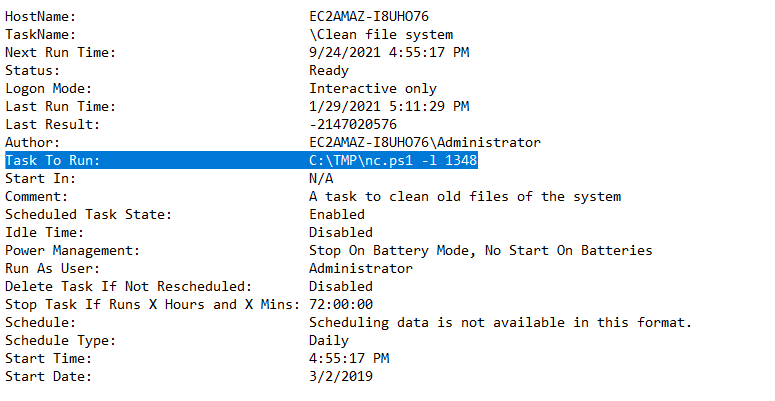
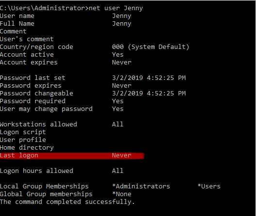
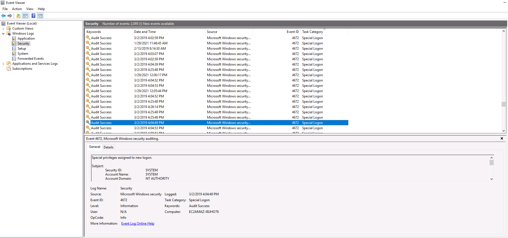
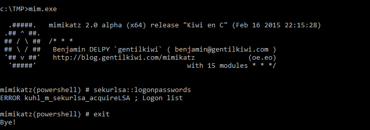
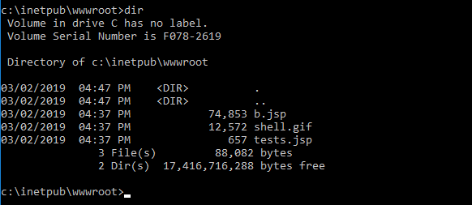
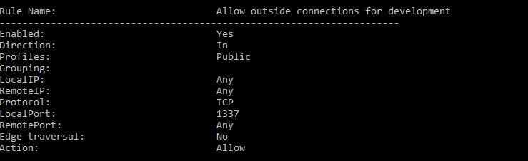
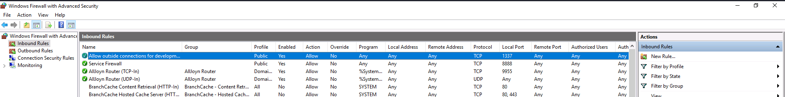

## Intro
**Link**: [Investigating Windows](https://tryhackme.com/room/investigatingwindows).

This challenge is about investigating a compromised Windows machine that has
been infected with malware. It is a great room for anyone trying to hone their
Windows surveying skills, not just incident responders.

We are given the following credentials to RDP into the system:

```
Username: Administrator
Password: letmein123!
```

Since I am on Kali Linux, I will use the rdesktop command to connect to the RDP
service running on the target.

```
$ rdesktop -u Administrator -p 'letmein123!' <IP>
```

Once the machine loads, it's time to start investigating!

---

## Challenge Questions

We are given a set of questions to answer to guide us along our
investigation. 


### Q1. Whats the version and year of the windows machine?

**Answer:** Windows Server 2016

**Command:** `winver`

Identifying the version is important because some tools only work on certain
versions of Windows. 

### Q2. Which user logged in last?

**Answer:** Administrator

**Command:** `reg query
HKLM\Software\Microsoft\Windows\CurrentVersion\Authentication\LogonUI`

Check the "LastLoggedOnUser" subkey.



### Q3. When did John log onto the system last

**Answer:** 03/02/2019 5:48:32 PM

**Command:** `net user john`


Tip: The `net` command is super useful for gather information on users, local folder
shares, group members, and more! 

### Q4. What IP does the system connect to when it first starts?

**Answer:** 10.34.2.3

**Command:** N/A

Upon logging into the system, a command prompt pops up attempting to
connect to 10.34.2.3 



### Q5. What two accounts had administrative privileges (other than the Administrator
user)?

Users in the Administrators group are given full, unrestricted access to the
system. So to find the other accounts with administrative privileges, we simply
need to check the local Administrators group.

**Answer:** Jenny, Guest

**Command:** `net localgroup Administrators`

### Q6. Whats the name of the scheduled task that is malicous?

**Answer:** Clean file system

**Command:**`schtasks /query /fo list /v > schtasks.txt`

The above command queries all scheduled tasks, and prints verbose output in list
format. 

There are a few tasks that look suspicious, but the exercise is asking for the
"Clean file system" task. The name is misleading - the program actually runs a netcat listener!



### Q7. What file was the task trying to run daily?

**Answer:** nc.ps1

**Command:** N/A

See Q6 screenshot. 

### Q8. What port did this file listen locally for?

**Answer:** 1348

**Command:** N/A

See Q6 screenshot.

### Q9. When did Jenny last logon?

**Answer:** Never

**Command:** `net user Jenny`



### Q10. At what date did the compromise take place?

**Answer:** 03/02/2019

**Command:** N/A

Check the "Start Date" field from the above Q6 schtasks screenshot.

### Q11. At what time did Windows first assign special privileges to a new logon?

To answer this question, we need to query the Windows Event Security Logs. There
will be a vast amount of entries so we need to narrow down the possible answers.

From Q10, we know that the machine was compromised on 03/02/2019, so we can
eliminate any log entries that happen before or after that date.

Furthermore, the provided hint tells us to look for time values of 49 seconds.

**Answer:** 03/02/2019 04:04:49 PM

**Command:** `wevtutil qe Security /f:text > security-logs.txt`

Alternatively, this can be done via the GUI tool Event Viewer.

Open it and navigate to Windows Logs > Security to view all logged security related events.




### Q12. What tool was used to get Windows passwords?

From previous questions we know the attacker created a C:\TMP directory. 

Within it is an executable named mim.exe. Run it and it will
print banner information for Mimikatz, a popular Windows exploitation tool.

**Answer:** Mimikatz

**Command:** `C:\TMP\mim.exe`




### Q13. What was the attackers external control and command servers IP?

Check the DNS hosts file to find the bogus connection to the attacks C2 server.

The file is located at C:\Windows\System32\drivers\etc\hosts.

**Answer:** 76.32.97.132

**Command:** `type C:\Windows\System32\drivers\etc\hosts`

Here is the entry:
```
76.32.97.132  google.com 
```

### Q14. What was the extension name of the shell uploaded via the servers website?

Microsoft IIS is the default web server for Windows, and is located in
**C:\inetpub\wwwroot**. 

Perform a directory listing of the folder to find the shells.

**Answer:** .jsp

**Command:** `dir C:\inetpub\wwwroot\`



### Q15. What was the last port the attacker opened?

We can check the last open port by examining the inbound rules on the Windows Firewall.

**Answer:** 1337

**Command:** `netsh advfirewall firewall show rule name=all > fw-rules.txt`




This can also be done in the ""Windows Firewall with Advanced Security" GUI.
Click on the "Inbound Rules" section and notice the first entry.




### Q16. Check for DNS poisoning, what site was targeted?

**Answer:** google.com

**Command:** `type C:\Windows\System32\drivers\etc\hosts`
