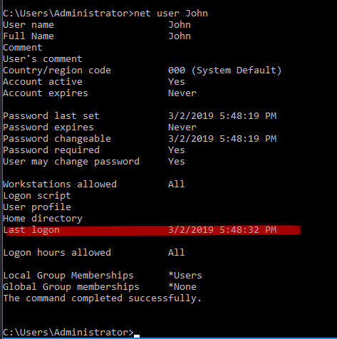

## Intro
**Link**: [Investigating Windows](https://tryhackme.com/room/investigatingwindows).

This challenge is about investigating a previously compromised Windows machine.
We are told to connect to the machine via RDP using the below credentials:

Username: Administrator
Password: letmein123!

Since I am on Kali Linux, I will use the rdesktop command to connect to the RDP
service running on the target.

```
$ rdesktop -u Administrator -p 'letmein123!' <IP>
```

## Challenge Questions

We are given a set of questions to answer to help guide us along our
investigation. 


**Whats the version and year of the windows machine?**
The version is Windows Server 2016, and can be found by running the `winver`
command. Identifying the version is important because not all commands
work on all versions of Windows.

**Which user logged in last?**
To find the last logged on user, check the
following registry key (note capitalization doesn't matter in Windows):

```
reg query HKLM\Software\Microsoft\Windows\CurrentVersion\Authentication\LogonUI
```

Then check the "LastLoggedOnUser" key.


**When did John log onto the system last?**
Enter `net user John` to print John's user information, including his last logon
date and time.



**What IP does the system connect to when it first starts?**
When you first RDP into the system, a command prompt pops up attempting to
connect to 10.34.2.3 


**What two accounts had administrative privileges (other than the Administrator
user)?**
To find which users have administrative privileges, we simply need to check the
Administrator group. 

Run `net localgroup Administrators` and you will find Jenny and Guest.

**Whats the name of the scheduled task that is malicous?**

Query all scheduled tasks and give verbose (/v) output.

```
schtasks /query /fo list /v > schtasks.txt
```

Notice the command named "Clean file system". It is misleading and actually runs
a netcat listener!


**What file was the task trying to run daily?**

See above screenshot. 

**What port did this file listen locally for?**
See above screenshot.

**When did Jenny last logon?**
Run `net user Jenny`.

**At what date did the compromise take place?**
Check the "Start Date" field from the above schtasks screenshot.

**At what time did Windows first assign special privileges to a new logon?**

To answer this question, we need to query the Windows Event Security Logs. This
can be done via the GUI or command line.

GUI: open up the program Event Viewer. Then navigate to Windows Logs >
Security to view all logged security related events.


Command Line: Run the below command to query security logs.

```
wevtutil qe Security /f:text > security-logs.txt
```

**What tool was used to get Windows passwords?**
In the C:\TMP file there is an executable named mim.exe. Execute it and it will
print out banner information for Mimikatz, a popular Windows exploitation tool.

**What was the attackers external control and command servers IP?**

Check the DNS hosts file: C:\Windows\System32\drivers\etc\hosts

The last line contains the following entry:

```
76.32.97.132  google.com 
```

The IP address is the attackers C2 server, and the site google.com is the answer
for the DNS poisoning question.

**What was the extension name of the shell uploaded via the servers website?**

Microsoft IIS is the default web server for Windows and is located in
**C:\inetpub\wwwroot**. 

Perform a directory listing of the folder and notice the .jsp extensions.


**What was the last port the attacker opened?**

We can check the last open port by examining the inbound rules on the Windows Firewall.


