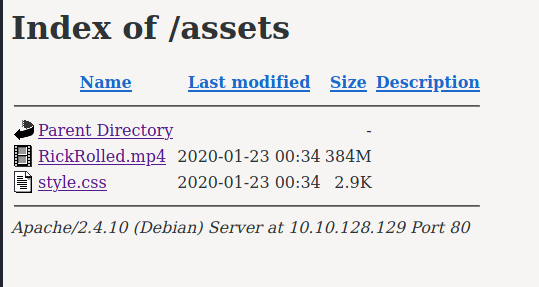
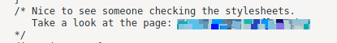

# Year of the Rabbit

## Initial Recon


Start by scanning ports and services with `nmap`.


I like to enumerate hidden directories with `gobuster`. 

```
$ gobuster -u http://10.10.128.129 -w /usr/share/wordlists/dirb/common.txt

/assets
/index.html
/server-status
```

Navigate to the /assets page:



The first item is a Rick Roll video, classic. The second is the CSS stylesheet
that specifies how the site looks. Inside it is the following comment:



However, this turned out to be a rabbit hole :/
